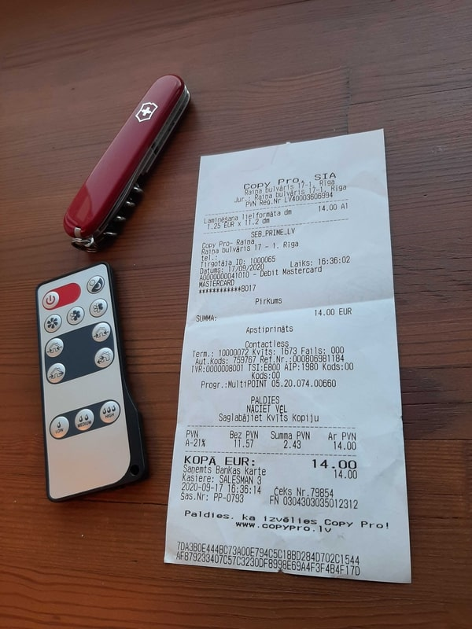
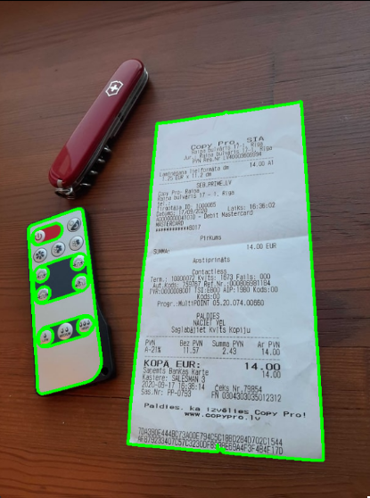
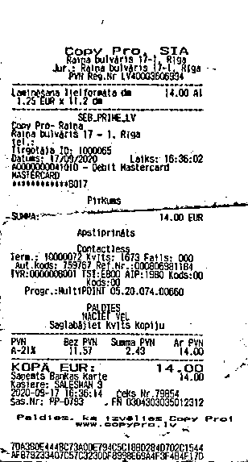
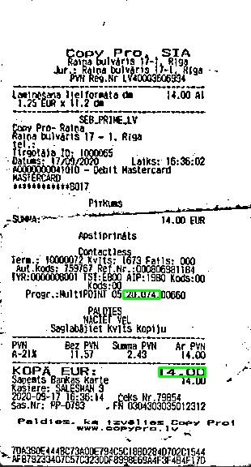
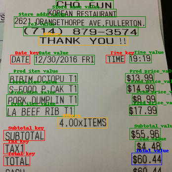

# Lecture automatique de factures

> **Projet de cours — (4ᵉ année d'école d'ingénieurs) - 2024/2025**
>
> **Étudiants :** Baptiste Behr · Thomas Kusnierek · Benjamin Szurek

Ce projet a pour objectif de **détecter automatiquement le montant total d'une facture** à partir de son image. Trois approches y sont mises en œuvre et comparées (Voir fichier .ipynb pour + de détails sur les codes, méthodes d'évaluations et résultats).

---

## 1. Modèle OpenCV + PyTesseract

Cette première approche repose sur du traitement d'image classique. À partir de l'image de départ :



les librairies OpenCV et PyTesseract sont utilisées pour détecter les contours, isoler le plus grand contour, recadrer et zoomer sur l'image, puis extraire le montant de la facture :

|  |  |  |
| :-------------------------------------: | :----------------------------------: | :---------------------------------------------: |
|         Détection des contours         |               Filtrage               |                 Prix détecté                 |

## 2. Modèle Hugging Face

Ce modèle a été **pré-entraîné à la détection de factures** ; il provient de la plateforme Hugging Face :

- Modèle : [https://huggingface.co/Theivaprakasham/layoutlmv3-finetuned-invoice](https://huggingface.co/Theivaprakasham/layoutlmv3-finetuned-invoice)
- Dépôt GitHub : [https://github.com/Theivaprakasham/layoutlmv3](https://github.com/Theivaprakasham/layoutlmv3)

Il permet d'obtenir ce type de résultat :



## 3. Modèle LLM (Gemma via Ollama)

Cette dernière approche utilise le modèle `gemma3:4b` servi par **Ollama**, interrogé pour détecter le montant de la facture.

> L'utilisation d'un **GPU** est fortement recommandée pour exécuter Ollama.

---

## Installation

```bash
pip install -r requirements.txt
```
